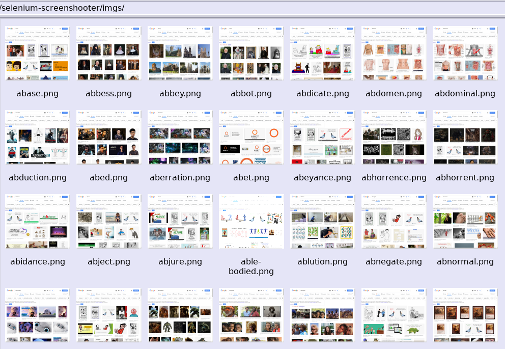
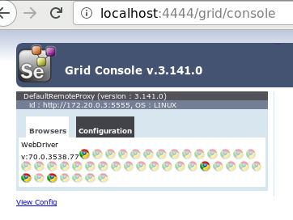
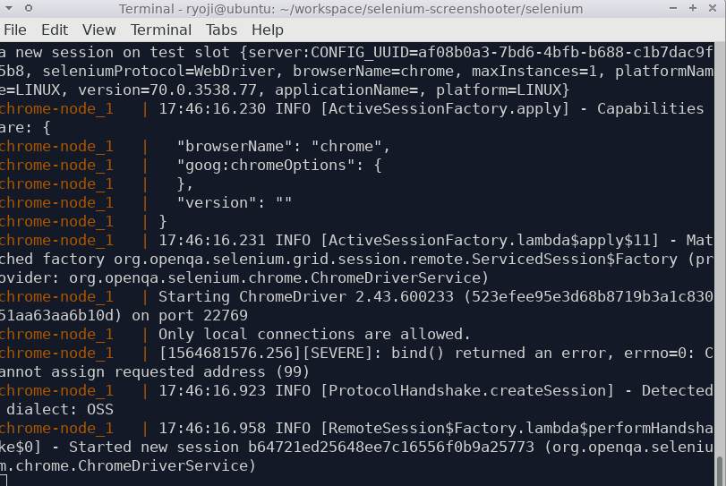
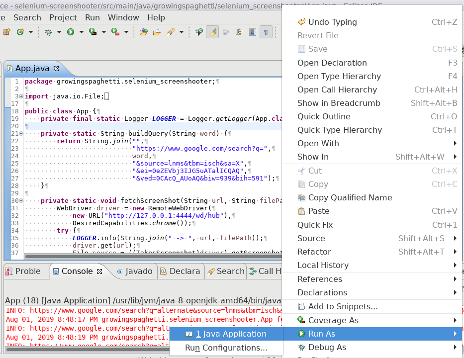
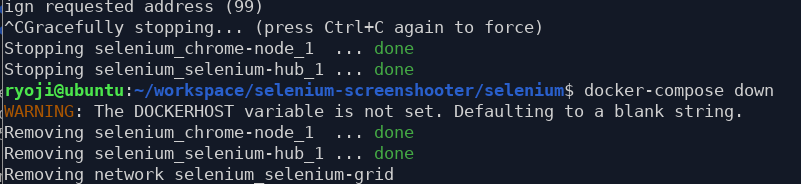

# selenium-screenshooter



40 async threads.
(40 nodes + CompletableFuture&ExecutorService)


# how to use

## run docker

```
cd selenium
./docker-run.sh
```
## run java


## turn off docker

```
ctrl+C
dockercompose down
```

